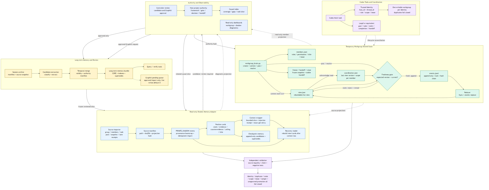

# agent-brain

A small, project-owned state layer for coordinating coding-agent workgroups
without treating chat history as durable memory.



## What it solves

Long agent sessions are routinely compressed, restarted, or split across
several tasks. This repository separates four concerns:

1. **Coordination** - optional LoopX goals, claims, completions, and handoffs.
2. **Ephemeral workgroups** - members, leases, append-only events, conflicts,
   frozen snapshots, and stable handoffs.
3. **Long-term memory** - reviewed facts with provenance, validity intervals,
   confidence, and explicit `supersedes` relationships.
4. **Host authority** - the existing project's decisions and release state
   remain outside this package and are never modified automatically.

The model context becomes a cache. Durable state lives in files that can be
verified and reconstructed.

## Implementation status

Version `0.2.0` includes an executable reference core:

| Capability | Status |
|---|---|
| Append-only workgroup runtime and leases | Implemented and exercised |
| Strict per-turn context/version protocol | Implemented and exercised |
| Single active workgroup per task identity by default | Implemented and exercised |
| Independent workgroup verifier | Implemented and exercised |
| Read-only local status page | Implemented and smoke-tested |
| Provenance-aware local memory ledger | Implemented and tested |
| Explicitly incomplete causal index | Implemented |
| Graphiti import-request generation | Implemented; live writes disabled |
| LoopX lifecycle reconciliation | Interface boundary only |
| Raw-session archival and classification pipeline | Design specification only |
| Host-project authority adapter | Intentionally not included |

The architecture diagram shows both the executable core and optional production
extensions. The [reproduction guide](docs/reproduction-guide.md) is a target
design for a fuller deployment; it is not a claim that every optional box is
shipped in this repository.

## Safety boundary

This public package contains only synthetic examples and generic code.

- No private project files, names, paths, task IDs, thread IDs, or datasets.
- No raw chat transcript or hidden chain of thought.
- Lease tokens are returned once and never written to shared state.
- Workgroup completion never becomes host-project completion automatically.
- Long-term memory candidates require an explicit promotion step.
- The Graphiti adapter only creates import requests; it does not perform live
  writes.

## Quick start

Requires Python 3.11+ and no third-party runtime dependency.

```powershell
git clone https://github.com/dkdzx/agent-brain.git
cd agent-brain
python examples/three_agent_demo.py
```

The demo creates a temporary controller/worker/reviewer workgroup, requires
each writer to acknowledge the current shared `view_version`, records a
disagreement, resolves it append-only, discards the in-process context,
freezes the result, creates a handoff, revokes all members, and runs an
independent verifier.

Run the tests:

```powershell
python -m unittest discover -s tests -v
```

Run the isolated durable workgroup-memory canary:

```powershell
python examples/workgroup-memory-v5/task_dispatch_gate.py
python examples/workgroup-memory-v5/run_v5_canary.py
python examples/workgroup-memory-v5/external_reader_v5.py
```

It keeps the raw event chain append-only, rebuilds after a simulated
interruption, compacts the normal context to an 8 KB budget, extracts
unreviewed group-memory candidates, and verifies LoopX-style
goal/todo/claim/group/handoff bindings without writing any production state.

Start the read-only status page:

```powershell
python src/agent_brain/workgroup_status_frontend.py `
  --runtime-root .demo-runtime `
  --host 127.0.0.1 `
  --port 8766
```

Open `http://127.0.0.1:8766/`.

Removed, expired, and revoked members are omitted from the visible workgroup
member list. Their lifecycle remains reconstructable from the append-only
event archive.

Visible member names are resolved from a stable `thread_id` to the actual
Codex task title. Internal member IDs and role names remain coordination keys,
not public names. Initial prompts, delegation markup, source-thread markup,
and automatic summaries are rejected as display titles. If no verified title
is available, the status page fails closed with `Task title pending sync`
instead of guessing a name from chat text.

New workgroups default to `strict` coordination. Every `post` and `resolve`
must carry the `expected_view_version` returned by that member's most recent
`context` call. A concurrent member update makes the old context stale and the
write fails closed until the member rereads shared state. The same
`host_id + thread_id` also belongs to only one writable workgroup by default.

## CLI

```text
create
add-member
remove-member
context
post
resolve
freeze
handoff
close
status
```

In strict mode, the normal turn protocol is:

```text
context → work → post/resolve --expected-view-version N
        → CONTEXT_STALE means reread and reconsider before publishing
```

Example:

```powershell
python src/agent_brain/workgroup_brain.py `
  --root .demo-runtime `
  status --group-id demo-group-001
```

Long-term memory:

```powershell
python src/agent_brain/long_term_memory.py --root .demo-memory add `
  --memory-id memory-001 `
  --author-type controller `
  --agent-id controller-001 `
  --source-thread synthetic-thread `
  --task-id synthetic-task `
  --content "The interface contract is stable." `
  --status active `
  --confidence 0.9 `
  --scope module-a `
  --evidence-ref evidence/interface.json

python src/agent_brain/long_term_memory.py --root .demo-memory query `
  --text "interface contract"
```

## Repository layout

```text
src/agent_brain/
  workgroup_brain.py            append-only workgroup runtime
                                plus strict context/version gate
  verify_workgroup_brain.py     independent reader/verifier
  workgroup_status_frontend.py  read-only local status page
  long_term_memory.py           provenance-aware memory ledger
  causal_index.py               incomplete causal index with gaps
  graphiti_export.py            optional Graphiti import-request builder
examples/
  three_agent_demo.py           full synthetic lifecycle
  workgroup-memory-v5/          durable group-memory and recovery canary
tests/
docs/
  overview.md
  reproduction-guide.md
assets/
  architecture-en.mmd           editable source based on the original diagram
  architecture-en.png           rendered architecture diagram
```

## Documentation

- [Short technical overview](docs/overview.md)
- [Full reproduction guide](docs/reproduction-guide.md)
- [Security and publication boundary](SECURITY.md)
- [Temporary workgroup prompt pack](prompts/workgroup-modes.zh-CN.md)

LoopX and Graphiti are optional adapters. The core workgroup and local memory
ledger remain usable when neither service is installed.
