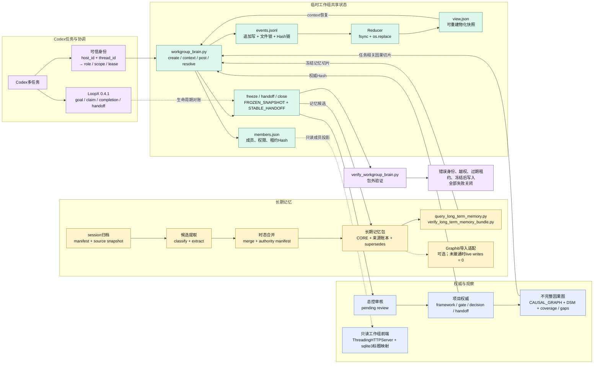

# Codex临时工作组、共享大脑，以及长期记忆

Codex多任务协作最大的问题不是模型不够聪明，而是任务一多、对话一长，临时结论、任务进度和长期事实全部混在聊天里。上下文压缩或更换对话后，成员就要重新转发历史。

我把它拆成了三层：

1. **LoopX**只管理任务、认领、完成和handoff。
2. **临时工作组**使用Python CLI、短期租约和追加式`events.jsonl`共享事实、假设、冲突和证据；`view.json`由事件账本重建，所以模型上下文可以丢失。
3. **长期记忆**先把旧session冻结、分类和时态合并，再保存来源、有效期和`supersedes`关系；Graphiti不可用时仍可用本地JSONL查询。

实际运行时，一名成员写入阶段结果，另一名成员在独立上下文中直接读到；相反意见会形成冲突，由总控追加解决记录，而不是覆盖旧内容。最后冻结、生成handoff并撤销全部成员。当前随仓库演示产生12个生命周期事件、5条工作记录，关闭后活跃成员和未解决冲突都为0。

最终效果是：成员不用互相转发聊天；上下文压缩后可以恢复；工作组共识、长期记忆和项目正式真值互不冒充。

完整目录、CLI、Schema、负例和复刻步骤见[完整复刻规范](reproduction-guide.md)。
